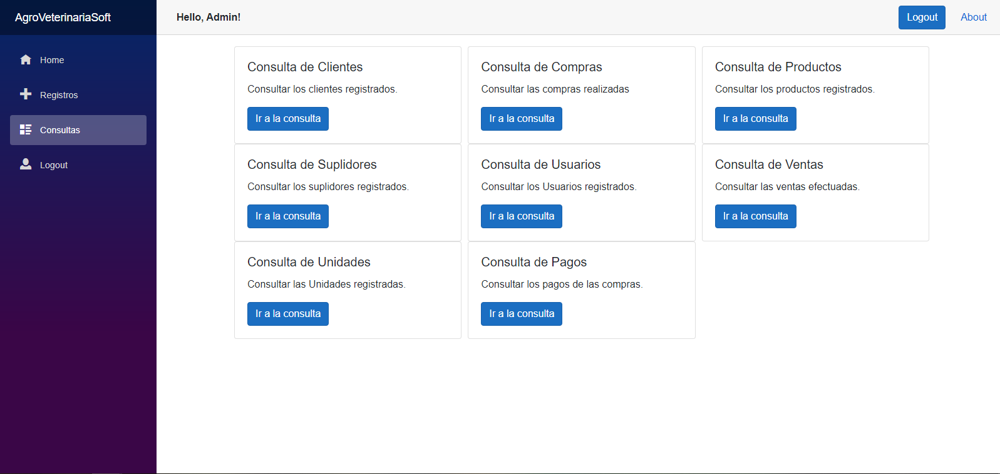

# AgroVeterinariaSoft

AgroveterinariaSoft es un programa para llevar control de un conjunto actividades de la empresa Agro-Veterinaria Emil, 
dedicada a la venta de productos agrícolas y veterinarios.

## :house: Pagina Principal (Home)

Esta ventana es el inicio que aparecerá cada vez que se cargue la pagina, en la parte 
izquierda encontramos un menú que cuenta con las siguientes ventanas:
1.	Inicio.
2.	Registros.
3.	Consultas.
4.	Login.

Cabe mencionar que las ventanas Registros y Consultas solo se ejecutaran dependiendo del nivel de usuario que posea (Se explicara más adelante). 

Lo primero que hay que hacer al abrir el programa es iniciar sesión.

## :bust_in_silhouette: Login
Aquí es donde los usuarios registrados podrán acceder al programa y poder registrar y consultar las diferentes operaciones que ofrece el programa. En caso de ser la primera vez deberá ingresar el usuario que existe por defecto.

Usuario: Admin
Contraseña: 12345
Este usuario solo servirá para crear otros usuarios por ende su único uso será para crear usuarios personalizados.

## :memo: Registros
   
   
## Introducción Básica a los registros
Al estar en un registro hay ciertas operaciones que se podrán hacer en todos los registros:
 

1. Nuevo: Esta acción se usa para limpiar los elementos de todos los campos, excelente para empezar a crear o buscar un usuario de nuevo.

2. Guardar:  Esta operación sirve para registrar nuevos objetos en el sistema. En caso de existir uno con el mismo identificador (ID), se modificará el objeto original en base a los nuevos datos ingresados. Teniendo en cuenta que solo se guardara si se encuentra debidamente llenado.

3. Buscar: Este se encarga de que mediante el identificador (ID) se verificara si existe en el sistema para ser traído para su posible modificación o eliminación.

4. Eliminar: Después de buscar el objeto esta opción se encargara de que si existe eliminarlo del sistema.

## Registro de Usuarios
  
  

En este apartado se podrán crear, modificar, buscar y eliminar los usuarios que se utilizaran para hacer las diferentes modificaciones del sistema.
Los Usuarios cuentan con tres niveles de Acceso:
1.	Nivel bajo: solo pueden acceder a los registros y consultas de compras y ventas.
2.	Nivel medio: pueden acceder a todos los registros y consultas excepto a los de usuarios.
3.	Nivel alto: pueden acceder a todos los apartados del sistema.

## Registro de Unidades
   

Es en este apartado donde el usuario a cargo podrá agregar las diferentes unidades de medidas que poseen nuestros productos.

## Registro de Productos.

   
   
En este apartado se guardarán, buscaran y eliminaran productos que se utilizaran para abastecer el inventario y ser destinados a su venta.
## Registro de Suplidores
   
En esta parte se guardarán, buscaran y eliminaran los suplidores que abastecerán la empresa de todos los productos necesarios para la venta.
## Registro de Clientes
   
Aquí es donde se almacenará, buscara y eliminara la información de nuestros clientes.
## Registros Compras 
  
Aquí es donde se realizaran las compras de los productos creados para abastecer el inventario, teniendo en cuenta que se deben crear los siguientes registros en el mismo orden:
*	Suplidores.
*	Unidades.
*	Productos.
## Registro de ventas 
   
Teniendo ya una cantidad razonable de los productos en cuestión se procede a llenar la ventana a ventas teniendo los siguientes campos teniendo ya los siguientes elementos
*	El cliente
*	El producto
*	La unidad

## Registro de Pagos
   

Este sirve para registrar los pagos de los productos a los proveedores de la empresa. Esta debe contar ya con los siguientes objetos.
*	Suplidores.
*	Unidades.
*	Productos.
*	1 o mas facturas de pago que pagar.

## :page_facing_up: Consultas 
  

## Introducción a las consultas 
El objetivo principal de estas ventanas es poder ver todos los elementos almacenados en el sistema, poder filtrar la información, ya sea para buscar un elemento en especifico como para comparar información.
   

1.	Filtrado de fechas: Permite buscar objetos desde una fecha de origen hasta una fecha límite.

2.	Habilitar/Deshabilitar Filtrado de Fecha: Este permitirá decidir si se filtrara o no por la fecha.

3.	Criterio: Un elemento que sirve para buscar un elemento en base a algo en común.

4.	Filtro: Una barra de selección que permite elegir en base a que se comparara el criterio de búsqueda. 

5.	Botón de búsqueda: Al presionarlo, en base a los elementos seleccionados 

6.	Filas y Columnas: cada fila representa un objeto determinado en el sistema, así como la columna una de las propiedades de este.

7.	Botón ver: Se encuentra dentro de cada fila. Permite abrir un registro del objeto, ya sea para borrarlo, modificarlo o simplemente mirarlo con detalle. 

8.	Paginación: Permite la vista de los objetos que se encuentren almacenados con un anterior o siguiente y un numero que sirva como índice de pagina para evitar rellenar de más la ventana.

## Todas las Consultas 
   
   
   
   
   
   
   
   

## :computer:Requisitos Mínimos del sistema:
*	Cualquier Dispositivo Compatible con Firefox, Chrome, Opera o Microsoft Edge
*	Conexión a internet Estable

## :pencil: Desarrollado con:
* Visual Studio (Blazor Apps) 
*	Entity Framework Core
*	SQLServer
*	Google Chrome

## :wrench: Desarrollado por
*	Emmanuel Suarez Taveras
*	Juan Francisco Rosa Cuevas

## :page_with_curl: Licencia 
Este programa está bajo la Licencia de los programadores Juan Francisco Rosa cuevas y Emmanuel Suarez Taveras.
Este proyecto está hecho únicamente con fines educativos, por ende esta prohibido el uso del programa con fines lucrativos.
